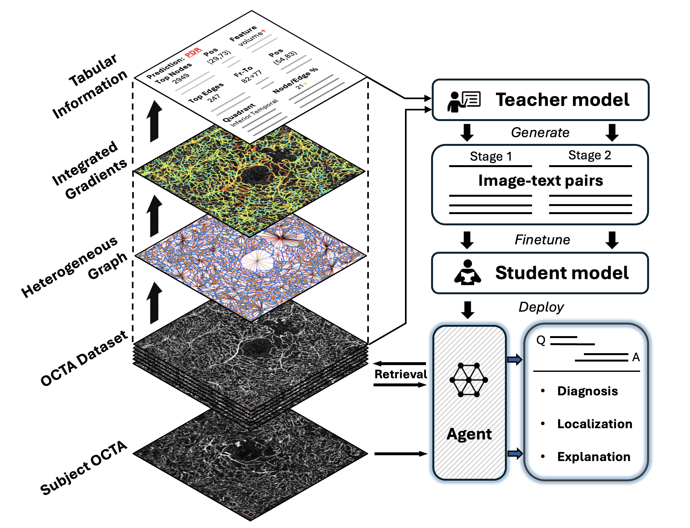
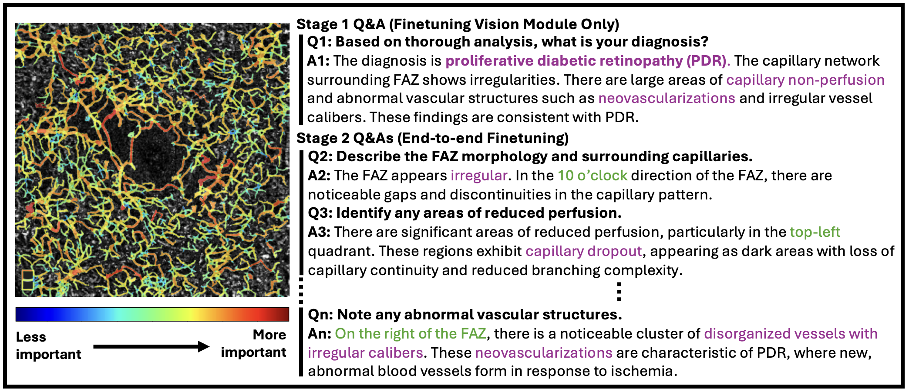
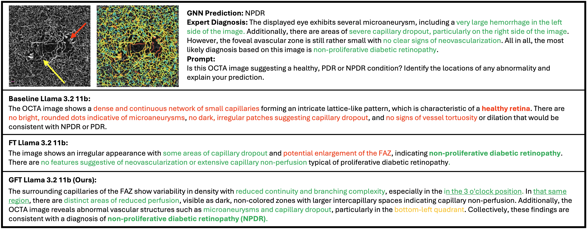

# GFT: Fine-tuning Vision Language Models with Graph-based Knowledge for Explainable Medical Image Analysis (MICCAI 2025)

> 🔎 **New:** our latest work on **trust-in-AI for DR diagnosis from OCTA** (survey).  
> **[[Link](https://octa-dr.streamlit.app/)]**

This repo releases a clean, working reference for our MICCAI paper, including a minimal GNN pipeline, integrated-gradients attribution, instruction data synthesis, and two-stage VLM fine-tuning & demo. Please see [here](https://github.com/luxtu/OCTA-graph) for the complete pipeline of GNN training.

> Data availability: The OCTA dataset used in our experiments is in-house and cannot be released. This repository does not include example images. Please prepare your own dataset (or a public OCT/OCTA dataset) and update the paths below accordingly.

## Figures

- **Method overview**

  

- **Instruction-tuning data examples**

  

- **Interpretability comparison**

  


## Quickstart
```bash
# 1) env
python -m venv .venv && source .venv/bin/activate
pip install -r requirements.txt

# 2) run a tiny GNN sanity-check on your data
python -m gft.training.train_gnn --data-dir <your_data_dir> --epochs 2

# 3) export IG table + synthetic Q&A (no external APIs)
python scripts/generate_instructions.py --data-dir <your_data_dir> --out instructions.jsonl

# 4) stage 1 finetune (classification + short rationale)
python -m gft.training.ft_stage1 --model unsloth/Llama-3.2-11B-Vision-Instruct --data instructions.jsonl --out checkpoints/stage1

# 5) stage 2 finetune (region-aware Q&A)
python -m gft.training.ft_stage2 --model checkpoints/stage1 --data instructions.jsonl --out checkpoints/stage2

# 6) launch demo
python -m gft.inference.deploy --model checkpoints/stage2
```

## Repo layout
```
src/gft
  data/                 # image reader, toy labels
  graphs/               # graph builder + IG attribution
  models/               # light GraphSAGE
  training/             # GNN trainer + VLM finetune stages
  inference/            # demo + single-image inference
  utils/                # misc helpers
scripts/
  generate_instructions.py
examples/
  configs/default.yaml
```

## Notes
- The **graph builder** here is a minimal stand-in: it splits an OCTA into tiles and extracts basic patch stats, so the whole stack runs end-to-end. Please see [here](https://github.com/luxtu/OCTA-graph) for the complete pipeline of graph construction.
- Finetuning uses **Unsloth** + **TRL**. If you prefer another stack, only the wrappers need to change.
- The demo streams tokens and accepts image + prompt.
- You must provide your own dataset path for all commands that take `--data-dir`.

## License
MIT
